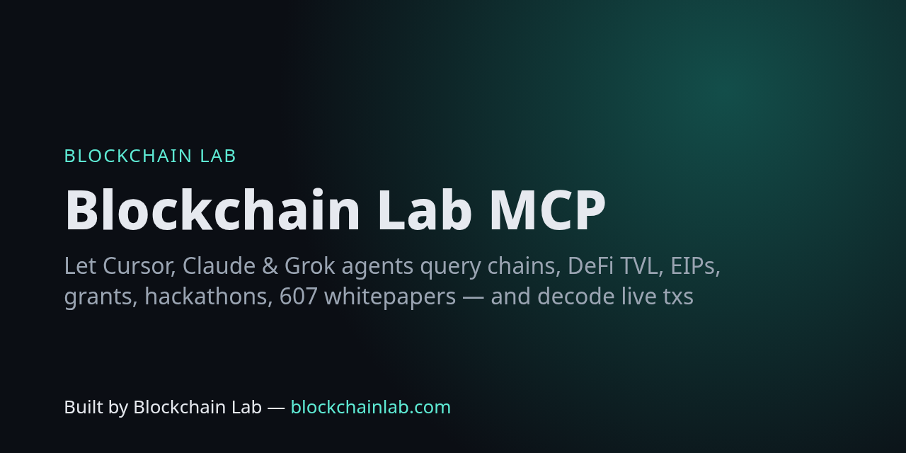

# Blockchain Lab MCP server + SDK



**Give AI agents (Cursor, Claude Desktop/Code, Grok, any MCP client) real blockchain knowledge and live on-chain tools.** 16 read-only tools over the [Blockchain Lab Open Data API](https://blockchains.github.io/blockchainlab-api/) and public RPCs. No API keys.

> Built by **Blockchain Lab — [blockchainlab.com](https://blockchainlab.com/?utm_source=github&utm_medium=readme&utm_campaign=blockchainlab-mcp)**

## Tools

| Tool | What it answers | Source |
|---|---|---|
| `search_whitepapers` | "Find papers on proof of stake from 2017" (600+ papers) | [Blockchain Lab corpus](https://blockchainlab.com/whitepaper?utm_source=github&utm_medium=readme&utm_campaign=blockchainlab-mcp) |
| `get_chain` | Chain ID → RPCs, explorers, currency | chainid.network |
| `top_defi_protocols` / `chains_tvl` | TVL rankings, filter by category/chain | DefiLlama (nightly) |
| `list_hackathons` / `list_events` | Open hackathons, upcoming events | [blockchainlab-feeds](https://github.com/Blockchains/blockchainlab-feeds) |
| `list_grants` | Grant programmes by ecosystem | curated, link-checked nightly |
| `glossary` | Plain-language definitions | blockchainlab.com |
| `lookup_standard` | EIP / ERC / BIP by number or title | ethereum/EIPs, ethereum/ERCs, bitcoin/bips |
| `gas_prices` | Live fees + USD cost (7 EVM chains, Bitcoin, Solana) | public RPCs, mempool.space, DefiLlama |
| `decode_transaction` | Decode any tx (call, args, logs, fees) | public RPCs + openchain |
| `inspect_address` | ENS, checksum, balance, contract/proxy/7702, ERC-20 | public RPCs |
| `decode_calldata` / `abi_utils` | Decode calldata, selectors, encode calls | openchain / 4byte |
| `convert_units` / `storage_slot` | wei↔ether etc., mapping/array/ERC-7201 slots (+ live read) | local + RPC |

## Install

Requires Node ≥ 18. Not yet on the npm registry — install straight from GitHub:

**Cursor** — `~/.cursor/mcp.json` (or `.cursor/mcp.json` in a project):

```json
{
  "mcpServers": {
    "blockchainlab": { "command": "npx", "args": ["-y", "github:Blockchains/blockchainlab-mcp"] }
  }
}
```

**Claude Desktop** — `claude_desktop_config.json`: same `mcpServers` block as above.

**Claude Code**

```bash
claude mcp add blockchainlab -- npx -y github:Blockchains/blockchainlab-mcp
```

**Grok / any MCP client (stdio)** — command `npx`, args `-y github:Blockchains/blockchainlab-mcp`.

**From source**

```bash
git clone https://github.com/Blockchains/blockchainlab-mcp && cd blockchainlab-mcp && npm ci
node bin/blockchainlab-mcp.js     # speaks MCP over stdio
```

Optional env: `BLOCKCHAINLAB_API` to point at a self-hosted copy of the data API.

Try asking your agent: *"What are the top 5 lending protocols on Arbitrum by TVL?"*, *"Decode tx 0x… on Base"*, *"Which grant programmes fund Bitcoin developers?"*, *"Summarise ERC-4337 and list related whitepapers."*

## SDK

```js
import { BlockchainLab, onchain } from "blockchainlab-mcp";   // or from a GitHub install

const bl = new BlockchainLab();
await bl.searchWhitepapers({ query: "rollup", limit: 5 });
await bl.topProtocols({ category: "Lending", chain: "Arbitrum", limit: 5 });
await bl.findChain("8453");
await bl.standard("ercs", "4337");

await onchain.evmFees("base");
await onchain.decodeTx("ethereum", "0x…");
await onchain.resolveEns("vitalik.eth");
```

## Tests (live, no mocks)

```bash
npm test   # SDK against the live API + spawns the real MCP server over stdio and calls all 16 tools
```

CI runs on Node 18/20/22 on every push and daily.

## Related

[Tools site](https://blockchains.github.io/blockchainlab-tools/) · [Open Data API](https://blockchains.github.io/blockchainlab-api/) · [Lens](https://github.com/Blockchains/blockchainlab-lens) · [Labs](https://github.com/Blockchains/blockchainlab-labs) · [Roadmap](https://github.com/Blockchains/blockchain-dev-roadmap)

MIT. Read-only: the server never signs or sends transactions. Not financial advice.

---
Built by Blockchain Lab — [blockchainlab.com](https://blockchainlab.com/?utm_source=github&utm_medium=readme&utm_campaign=blockchainlab-mcp)
